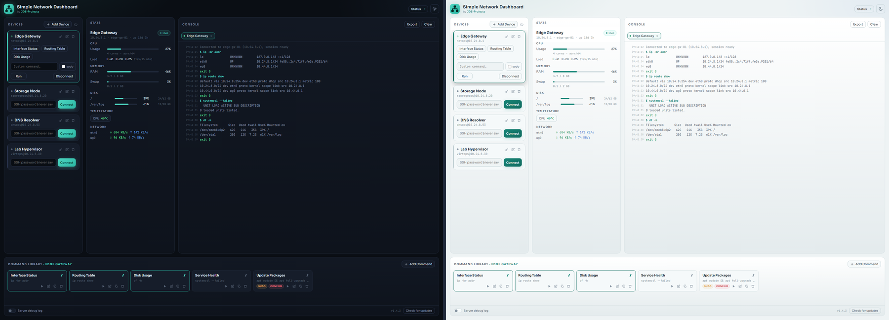

# Simple Network Dashboard
A self-hosted web dashboard for monitoring and managing home lab devices over a private local network.
Built by [JDE-Projects](https://jde-projects.com), home of the Simple X Tools suite.

If you enjoyed this project and would like to buy me a coffee, check out my [Ko-fi](https://ko-fi.com/jdeprojects).

## Preview
<p align="center">
  
  <br><em>Dark and light themes</em>
</p>

## Highlights
- Live device stats for CPU, RAM, disk, temperature, and network activity
- SSH management per device: run saved commands or one-off custom commands with live console output
- Per-device command library with pinned quick-buttons, optional sudo, and optional confirm prompts
- SSH passwords are never saved: held in server memory only while connected, wiped immediately on disconnect
- Local HTTPS out of the box: Caddy terminates the connection and proxies to the dashboard
- A single dashboard password protects access, with sign-in, sign-out, and an optional "remember this browser" option

## Deploy

**Prerequisites, on each device you want to monitor (Ubuntu / Raspberry Pi OS):**
```bash
sudo apt install prometheus-node-exporter
```

**On the server that will host the dashboard (requires Python 3.10+):**

1. Download the latest release tarball (`simple-network-dashboard-vX.Y.Z.tar.gz`) from the [Releases](https://github.com/JDE-Projects/Simple-Network-Dashboard/releases) page.
2. Optionally [verify the download](#verify-this-download-optional).
3. Extract and install:
```bash
tar -xzf simple-network-dashboard-vX.Y.Z.tar.gz
cd simple-network-dashboard-vX.Y.Z
sudo bash install.sh
```

During install you will be asked to set a dashboard password (15 to 128
characters). This is the only credential the dashboard checks; it is stored
only as a salted Argon2id hash, never in plain text. Change it later with
`sudo snd-reset-password`.

Open the HTTPS address printed by the installer and sign in with that
password. The installer configures Caddy and, when UFW is active, its HTTPS
rule automatically. Do not open the internal backend port manually.

If the HTTPS port you chose is already used by something other than this
dashboard's own Caddy setup, the installer stops without changing anything and
suggests a free port to re-run with; it does not pick one for you
automatically.

Optional installer arguments:

- `--https-host HOST`: use a DNS name that resolves to the server, or a private IPv4 address assigned to it.
- `--https-port N`: use an external HTTPS port other than 443.
- `--port N`: override the internal backend port, which is normally selected automatically.

### Trust the local certificate on Windows

Open the certificate-setup address printed by the installer and download
`caddy-root-ca.crt`. Before trusting it, compare the installer's SHA-256 value
with:

```powershell
Get-FileHash -Path "$env:USERPROFILE\Downloads\caddy-root-ca.crt" -Algorithm SHA256
```

Only after the values match, import it for the current Windows user:

```powershell
Import-Certificate -FilePath "$env:USERPROFILE\Downloads\caddy-root-ca.crt" -CertStoreLocation Cert:\CurrentUser\Root
```

Uninstalling the dashboard does not remove a certificate imported into Windows.

### Verify this download (optional)

Check the SHA-256 checksum:
```bash
sha256sum -c simple-network-dashboard-vX.Y.Z.tar.gz.sha256
```

Check the build attestation (requires the [GitHub CLI](https://cli.github.com/)):
```bash
gh attestation verify simple-network-dashboard-vX.Y.Z.tar.gz \
  --repo JDE-Projects/Simple-Network-Dashboard \
  --signer-repo JDE-Projects/Build-Tools
```

This proves the tarball was packaged by the published GitHub Actions pipeline from this public source, not on a personal machine. The `--signer-repo` flag is required because the workflow lives in a separate repository.

## Updating

Download the new release tarball, extract it, and re-run the installer:
```bash
tar -xzf simple-network-dashboard-vX.Y.Z.tar.gz
cd simple-network-dashboard-vX.Y.Z
sudo bash install.sh
```
The installer preserves dashboard data, your dashboard password, the internal
backend port, and the local certificate authority. If you use a custom HTTPS
host or port, pass those options again when updating; the default HTTPS port
is 443.

The dashboard's bottom bar also has a **Check for updates** button that tells you when a newer release is available.

## Using it
1. Sign in with the dashboard password. Check **Remember this browser** to stay
   signed in on that browser for 30 days; otherwise the session lasts 24 hours.
2. Click **Add Device** and enter the display name, IP address, SSH username, and Node Exporter port (default 9100).
3. Stats appear automatically: CPU, RAM, disk, temperature, and network rates.
4. To manage a device via SSH, enter the password for that device and click **Connect**.
5. Use the **Command Library** to save, pin, and reuse commands per device.
6. Pinned commands appear as quick-run buttons directly on the device card.
7. Use **Sign out** to end your session on that browser immediately.

## Uninstall

Run the uninstaller from the extracted release folder or from an installed system:
```bash
sudo bash uninstall.sh
# or, on an installed system:
sudo bash /opt/simple-network-dashboard/uninstall.sh
```

Before removing data, the uninstaller offers to back up `devices.json` and
`known_hosts`. It removes the dashboard service, files, private data, logs,
owned Caddy configuration, and owned UFW rules. Shared Caddy configuration and
its local certificate authority are preserved. Pass `--yes` for a
non-interactive backup and uninstall.

## Security and privacy
- The dashboard is protected by a single password stored only as an Argon2id
  hash. Traffic is encrypted with the locally issued HTTPS certificate.
  Sign-in sets a browser cookie that only that browser can use; repeated
  failed logins are slowed down automatically.
- SSH passwords are never written to disk. They are held in server memory only while a session is active and wiped immediately on disconnect.
- `devices.json` contains no credentials, but it maps internal hosts and usernames. Treat it as sensitive and do not share it publicly.
- The dashboard is intended for use on a private, trusted LAN only. Do not expose or port-forward it to the internet, even with the password in place.
- **Network use.** Other than the job you ask of it, this app makes one other network call: a check to GitHub for a newer release when you press **Check for updates**, which sends only a version request. It collects and sends no personal data, usage data, or analytics.

## A note on how this was built
This project was built with AI assistance. The design decisions, feature direction, and real-world testing were directed by me. The code was written and revised with an AI assistant against that direction. Treat it like any community tool: review and test it before relying on it.

## License
Released under the [PolyForm Noncommercial License 1.0.0](LICENSE).
Personal and noncommercial use, modification, and redistribution are
permitted; commercial use is not. See [THIRD-PARTY-LICENSES.txt](THIRD-PARTY-LICENSES.txt)
for notices on bundled dependencies.

For commercial licensing, open a [GitHub issue](https://github.com/JDE-Projects/Simple-Network-Dashboard/issues) with the title "Commercial License Inquiry".
